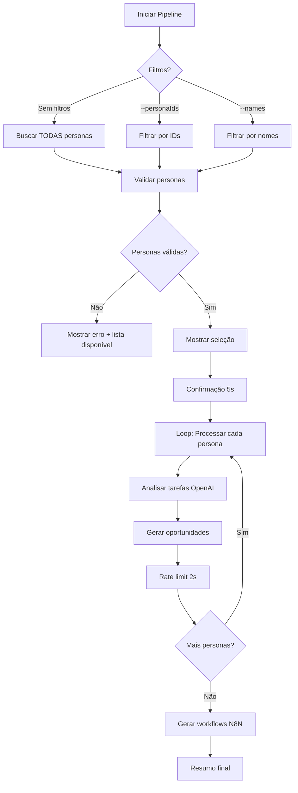

# 🚀 Pipeline de Workflows - Execução Seletiva

## 📋 Visão Geral

Sistema de geração de workflows com suporte a execução seletiva de personas específicas, permitindo maior controle e economia de recursos LLM.

---

## 🛠️ Scripts Disponíveis

### 1. `list_personas.js` - Listar Personas
Lista todas as personas disponíveis com seus IDs, facilitando a seleção para pipelines.

```bash
# Listar personas da empresa padrão (ARVA)
node list_personas.js

# Listar personas de empresa específica
node list_personas.js --empresaId=UUID
```

**Output exemplo:**
```
📋 LISTAGEM DE PERSONAS
================================================================================
🏢 Empresa: ARVA Tech Solutions (ARVATE49)
================================================================================

Total: 15 personas

📁 EXECUTIVO (4)
--------------------------------------------------------------------------------
1. Sarah Johnson
   Role: CEO | Specialty: Liderança
   ID: 07acdccc-ac86-41cd-9c19-2c95bfc82be9

2. Michael Johnson
   Role: CTO | Specialty: Tecnologia
   ID: fe5d76ce-f793-4f2a-9df0-1e5b6d756d10
...
```

---

### 2. `run_full_pipeline_openai.js` - Executar Pipeline

Executa análise de tarefas e geração de workflows com OpenAI GPT-4.

#### **Opção 1: Todas as personas** (padrão)
```bash
node run_full_pipeline_openai.js
```
- Processa TODAS as 15 personas da empresa
- Tempo estimado: ~3 minutos
- ~75 chamadas LLM

#### **Opção 2: Personas específicas por ID**
```bash
# Uma persona
node run_full_pipeline_openai.js --personaIds=07acdccc-ac86-41cd-9c19-2c95bfc82be9

# Múltiplas personas (separadas por vírgula, sem espaços)
node run_full_pipeline_openai.js --personaIds=id1,id2,id3
```

#### **Opção 3: Personas por nome (match parcial)**
```bash
# Busca case-insensitive, match parcial no nome
node run_full_pipeline_openai.js --names="Sarah,Michael"

# Também funciona com sobrenomes
node run_full_pipeline_openai.js --names="Johnson"

# Ou partes do nome
node run_full_pipeline_openai.js --names="Wil"  # Encontra William, Wilson, etc
```

---

## 📊 Fluxo de Execução



---

## 🎯 Casos de Uso

### Desenvolvimento e Teste
```bash
# Testar com 1 persona específica
node run_full_pipeline_openai.js --names="Sarah"

# Testar com CEO e CTO apenas
node run_full_pipeline_openai.js --names="CEO,CTO"
```

### Atualização Seletiva
```bash
# Regenerar workflows apenas do time de SDR
node run_full_pipeline_openai.js --names="SDR"

# Regenerar workflows de Marketing
node run_full_pipeline_openai.js --names="Marketing"
```

### Produção Completa
```bash
# Processar todas as personas (produção)
node run_full_pipeline_openai.js
```

---

## ⚙️ Configuração

### Rate Limiting
```javascript
const CONFIG = {
  DELAY_BETWEEN_CALLS: 2000,  // 2s entre chamadas
  CALLS_PER_PERSONA: 5,        // ~5 chamadas LLM por persona
};
```

### Estimativas de Tempo
| Personas | Chamadas LLM | Tempo Estimado |
|----------|--------------|----------------|
| 1        | ~5           | ~10 segundos   |
| 5        | ~25          | ~1 minuto      |
| 15       | ~75          | ~3 minutos     |

---

## 📝 Output do Pipeline

### Durante Execução
```
================================================================================
🚀 PIPELINE DE WORKFLOWS - OPENAI GPT-4
================================================================================

📊 CONFIGURAÇÃO:
   • LLM: OpenAI GPT-4 Turbo
   • Rate limiting: 2000ms entre chamadas

🎯 Filtrando por nomes: Sarah, Michael

📋 2 persona(s) selecionada(s):
   - Sarah Johnson (CEO)
   - Michael Johnson (CTO)

⏱️  ESTIMATIVA DE EXECUÇÃO:
   • Total de chamadas LLM: ~10
   • Tempo estimado: ~1 minutos

Pressione Ctrl+C nos próximos 5 segundos para cancelar...

▶️  Iniciando pipeline...

[1/2] 👤 Sarah Johnson (CEO)
   🔍 Analisando tarefas com OpenAI GPT-4...
   ✅ 12 tarefas analisadas em 3.2s
   🎯 4 oportunidade(s) de automação encontrada(s)
   ⏸️  Aguardando 2.0s (rate limiting)...

[2/2] 👤 Michael Johnson (CTO)
   🔍 Analisando tarefas com OpenAI GPT-4...
   ✅ 10 tarefas analisadas em 2.8s
   🎯 3 oportunidade(s) de automação encontrada(s)

================================================================================
📊 RESUMO DA EXECUÇÃO
================================================================================
✅ Sucesso: 2/2 personas
❌ Erros: 0/2 personas
```

### Após Conclusão
```
================================================================================
🔄 GERANDO WORKFLOWS N8N...
================================================================================

✅ Workflows N8N gerados com sucesso!

================================================================================
🎉 PIPELINE COMPLETO FINALIZADO!
================================================================================

📈 Próximos passos:
   1. Acesse /workflows para visualizar os workflows gerados
   2. Configure credenciais N8N em /integracoes
   3. Ative os workflows desejados
```

---

## 🐛 Troubleshooting

### Erro: "Nenhuma persona encontrada"
```bash
# Verifique os nomes disponíveis
node list_personas.js

# Use match parcial ou exato
node run_full_pipeline_openai.js --names="Sarah"  # OK
node run_full_pipeline_openai.js --names="sara"   # OK (case-insensitive)
```

### Erro: "Cannot find module"
```bash
# Certifique-se de estar no diretório AUTOMACAO
cd AUTOMACAO
node run_full_pipeline_openai.js
```

### Pipeline interrompido
```bash
# O pipeline pode ser retomado a qualquer momento
# Personas já processadas não serão duplicadas
node run_full_pipeline_openai.js
```

---

## 📚 Arquivos Relacionados

- `run_full_pipeline_openai.js` - Script principal do pipeline
- `list_personas.js` - Listagem de personas disponíveis
- `02.5_analyze_tasks_for_automation.js` - Análise individual (OpenAI)
- `03_generate_n8n_from_tasks.js` - Geração de workflows N8N
- `quick_check.cjs` - Verificação rápida do banco de dados

---

## 🔄 Workflow Completo

1. **Listar personas disponíveis:**
   ```bash
   node list_personas.js
   ```

2. **Escolher personas e executar pipeline:**
   ```bash
   node run_full_pipeline_openai.js --names="Sarah,Michael"
   ```

3. **Verificar resultados:**
   ```bash
   node quick_check.cjs
   ```

4. **Visualizar na interface:**
   - Acesse http://localhost:3001/workflows
   - Selecione as personas processadas
   - Visualize workflows gerados

---

## ✅ Benefícios da Execução Seletiva

- ⚡ **Rapidez**: Processa apenas o necessário
- 💰 **Economia**: Reduz custos de API LLM
- 🎯 **Foco**: Testa/atualiza personas específicas
- 🔄 **Flexibilidade**: Múltiplas opções de filtro
- 🐛 **Debug**: Isola problemas em personas individuais

---

**Última atualização:** 28/11/2025
**Versão:** 2.0.0 (Execução Seletiva)
