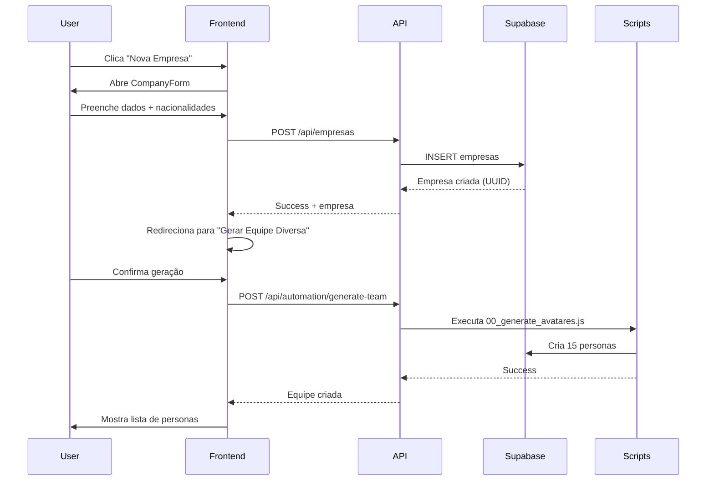

# 🏗️ VCM - DOCUMENTAÇÃO TÉCNICA DO SISTEMA

**Virtual Company Manager - Sistema de Gestão de Empresas Virtuais com Multi-Agentes AI**

**Versão:** 2.0.0  
**Data:** 29 de Novembro de 2025  
**Status:** Produção  

---

## 📋 ÍNDICE

1. [Visão Geral](#visão-geral)
2. [Arquitetura do Sistema](#arquitetura-do-sistema)
3. [Stack Tecnológico](#stack-tecnológico)
4. [Banco de Dados](#banco-de-dados)
5. [Scripts de Automação](#scripts-de-automação)
6. [Frontend e UI](#frontend-e-ui)
7. [Integrações Externas](#integrações-externas)
8. [Fluxos de Trabalho](#fluxos-de-trabalho)
9. [Deploy e Infraestrutura](#deploy-e-infraestrutura)
10. [Segurança](#segurança)

---

## 🎯 VISÃO GERAL

### O que é o VCM?

O Virtual Company Manager (VCM) é um sistema full-stack que cria e gerencia **empresas virtuais autônomas** através de múltiplos agentes AI especializados (personas). Cada persona é um assistente AI com:

- **Perfil completo**: biografia, competências, aparência física, personalidade
- **Competências técnicas**: alinhadas aos 12 subsistemas VCM
- **Tarefas estruturadas**: diárias, semanais e mensais
- **Avatar multimedia**: fotos profissionais geradas por AI
- **Autonomia**: capaz de executar tarefas de forma independente

### Casos de Uso

1. **Simulação de empresas** para treinamento e testes
2. **Automação de processos** com agentes especializados
3. **Prototipagem de organizações** antes da contratação real
4. **Research e análise** de estruturas organizacionais ideais
5. **Demonstrações comerciais** de produtos B2B

---

## 🏗️ ARQUITETURA DO SISTEMA

### Arquitetura Geral

```
┌─────────────────────────────────────────────────────────┐
│                     FRONTEND (Next.js 14)                │
│  ┌─────────────┐  ┌──────────────┐  ┌────────────────┐ │
│  │   Empresas  │  │   Personas   │  │  12 Subsistemas│ │
│  └─────────────┘  └──────────────┘  └────────────────┘ │
└─────────────────────────────────────────────────────────┘
                           │
                           ▼
┌─────────────────────────────────────────────────────────┐
│              API ROUTES (Next.js API)                    │
│  /api/empresas  │  /api/personas  │  /api/automation   │
└─────────────────────────────────────────────────────────┘
                           │
                           ▼
┌─────────────────────────────────────────────────────────┐
│               BANCO DE DADOS (Supabase)                  │
│  empresas │ personas │ avatares_personas │ avatares_    │
│  multimedia │ fluxos_sdr │ configuracoes                │
└─────────────────────────────────────────────────────────┘
                           │
                           ▼
┌─────────────────────────────────────────────────────────┐
│           SCRIPTS DE AUTOMAÇÃO (Node.js)                 │
│  00_avatares  │  01_biografias  │  02_competencias      │
│  03_tech_specs  │  04_rag  │  05_fluxos  │  06_avatares│
└─────────────────────────────────────────────────────────┘
                           │
                           ▼
┌─────────────────────────────────────────────────────────┐
│          INTEGRAÇÕES EXTERNAS (AI Services)              │
│  Google Gemini  │  OpenAI  │  Fal.ai  │  Supabase      │
└─────────────────────────────────────────────────────────┘
```

### Componentes Principais

#### 1. **Frontend - Next.js 14**
- **App Router** (src/app/)
- **React Server Components** + **Client Components**
- **TanStack Query** para cache e estado
- **shadcn/ui** + **Tailwind CSS** para UI
- **Porta:** 3001 (dev) / 3000 (prod)

#### 2. **Backend - API Routes**
- **REST APIs** em Next.js API Routes
- **Rotas principais:**
  - `/api/empresas` - CRUD de empresas
  - `/api/personas` - CRUD de personas
  - `/api/automation` - Execução de scripts
  - `/api/health` - Healthcheck

#### 3. **Banco de Dados - Supabase PostgreSQL**
- **PostgreSQL 15** com Supabase
- **Real-time subscriptions** para atualizações live
- **RLS (Row Level Security)** para segurança
- **Storage** para arquivos JSON e logs

#### 4. **Automação - Scripts Node.js**
- **7 scripts principais** no diretório `AUTOMACAO/`
- **Integração com LLMs** (Gemini, OpenAI)
- **Geração de conteúdo** via AI
- **Salvamento automático** no Supabase

#### 5. **Deploy - Docker + VPS**
- **Multi-stage Docker build**
- **docker-compose** para orquestração
- **Nginx** como reverse proxy
- **Healthcheck** e monitoramento

---

## 💻 STACK TECNOLÓGICO

### Frontend
```json
{
  "framework": "Next.js 14.2.x",
  "runtime": "Node.js 20.x",
  "language": "TypeScript 5.x",
  "ui": "shadcn/ui + Tailwind CSS 3.x",
  "state": "TanStack Query (React Query) 5.x",
  "forms": "react-hook-form + zod",
  "icons": "lucide-react"
}
```

### Backend
```json
{
  "api": "Next.js API Routes",
  "orm": "Supabase Client (@supabase/supabase-js)",
  "validation": "Zod schemas",
  "database": "Supabase PostgreSQL 15"
}
```

### Automação (Scripts)
```json
{
  "runtime": "Node.js 20.x (ES Modules)",
  "llm_primary": "Google Gemini 1.5 Flash (@google/generative-ai)",
  "llm_secondary": "OpenAI GPT-4 (openai)",
  "image_generation": "Fal.ai Flux-Pro (@fal-ai/serverless-client)",
  "database": "Supabase Client"
}
```

### Infraestrutura
```json
{
  "container": "Docker 24.x",
  "orchestration": "docker-compose",
  "reverse_proxy": "Nginx 1.25",
  "vps": "Linux (Ubuntu 22.04 LTS)",
  "ci_cd": "GitHub Actions (planejado)"
}
```

---

## 🗄️ BANCO DE DADOS

### Schema Principal

#### Tabela: `empresas`
```sql
CREATE TABLE empresas (
  id UUID PRIMARY KEY DEFAULT gen_random_uuid(),
  nome VARCHAR(255) NOT NULL,
  codigo VARCHAR(50) UNIQUE NOT NULL,
  industria VARCHAR(100),
  dominio TEXT,
  descricao TEXT,
  pais VARCHAR(10) DEFAULT 'BR',
  status VARCHAR(20) DEFAULT 'ativa',
  
  -- Diversidade da equipe
  ceo_gender VARCHAR(20),
  executives_male INT DEFAULT 2,
  executives_female INT DEFAULT 2,
  assistants_male INT DEFAULT 2,
  assistants_female INT DEFAULT 3,
  specialists_male INT DEFAULT 3,
  specialists_female INT DEFAULT 3,
  
  -- Nacionalidades (JSONB array)
  nationalities JSONB DEFAULT '[]',
  
  -- Idiomas
  idiomas TEXT[] DEFAULT '{}',
  
  -- Status dos scripts
  scripts_status JSONB DEFAULT '{
    "rag": false,
    "fluxos": false,
    "workflows": false,
    "biografias": false,
    "tech_specs": false,
    "competencias": false
  }',
  
  total_personas INT DEFAULT 15,
  created_at TIMESTAMP DEFAULT NOW(),
  updated_at TIMESTAMP DEFAULT NOW()
);
```

**Exemplo de dados:**
```json
{
  "id": "7761ddfd-0ecc-4a11-95fd-5ee913a6dd17",
  "nome": "ARVA Tech Solutions",
  "codigo": "ARVA001",
  "nationalities": [
    {"tipo": "americanos", "percentual": 40},
    {"tipo": "brasileiros", "percentual": 30},
    {"tipo": "europeus", "percentual": 20},
    {"tipo": "asiaticos", "percentual": 10}
  ]
}
```

#### Tabela: `personas`
```sql
CREATE TABLE personas (
  id UUID PRIMARY KEY DEFAULT gen_random_uuid(),
  empresa_id UUID REFERENCES empresas(id) ON DELETE CASCADE,
  
  -- Dados básicos
  full_name VARCHAR(255) NOT NULL,
  email VARCHAR(255),
  role VARCHAR(100),
  department VARCHAR(100),
  seniority_level VARCHAR(50),
  
  -- Características
  gender VARCHAR(20),
  nationality VARCHAR(50),
  age_range VARCHAR(20),
  
  -- Hierarquia
  reports_to UUID REFERENCES personas(id),
  
  -- Competências (referência ao arquivo JSON)
  competencias_file_path TEXT,
  
  created_at TIMESTAMP DEFAULT NOW(),
  updated_at TIMESTAMP DEFAULT NOW()
);
```

#### Tabela: `personas_avatares`
```sql
CREATE TABLE personas_avatares (
  id UUID PRIMARY KEY DEFAULT gen_random_uuid(),
  persona_id UUID REFERENCES personas(id) ON DELETE CASCADE,
  
  -- Biografia gerada por LLM
  biografia_completa TEXT,
  biografia_resumida TEXT,
  
  -- Aparência física (JSON detalhado)
  physical_appearance JSONB,
  
  -- Personalidade
  personality_traits JSONB,
  
  -- Metadados
  ethnicity VARCHAR(50),
  age_range VARCHAR(20),
  gender VARCHAR(20),
  body_type VARCHAR(50),
  
  generation_service VARCHAR(50) DEFAULT 'gemini',
  generated_at TIMESTAMP DEFAULT NOW()
);
```

**Exemplo de physical_appearance:**
```json
{
  "age": "mid-30s",
  "height": "5'9\" (175cm)",
  "build": "Athletic",
  "skin_tone": "Medium",
  "hair": "Dark brown, short professional cut",
  "eyes": "Brown",
  "distinctive_features": "Friendly smile, professional demeanor"
}
```

#### Tabela: `avatares_multimedia`
```sql
CREATE TABLE avatares_multimedia (
  id UUID PRIMARY KEY DEFAULT gen_random_uuid(),
  empresa_id UUID REFERENCES empresas(id) ON DELETE CASCADE,
  
  -- Tipo e categoria
  avatar_type VARCHAR(50) CHECK (avatar_type IN ('photo', 'video', 'animated_gif', '3d_render', 'illustration')),
  avatar_category VARCHAR(100) DEFAULT 'profile',
  
  -- Personas (suporta múltiplas para fotos de equipe)
  personas_ids UUID[] NOT NULL,
  personas_metadata JSONB,
  
  -- Arquivos
  file_url TEXT NOT NULL,
  file_thumbnail_url TEXT,
  
  -- Metadados
  title VARCHAR(255),
  description TEXT,
  prompt_used TEXT,
  generation_metadata JSONB,
  
  -- Configurações
  style VARCHAR(100) DEFAULT 'professional',
  use_cases TEXT[] DEFAULT '{}',
  tags TEXT[] DEFAULT '{}',
  
  -- Status e métricas
  status VARCHAR(50) DEFAULT 'completed',
  is_approved BOOLEAN DEFAULT true,
  generation_service VARCHAR(50) DEFAULT 'fal',
  view_count INT DEFAULT 0,
  download_count INT DEFAULT 0,
  usage_count INT DEFAULT 0,
  
  generation_completed_at TIMESTAMP,
  created_at TIMESTAMP DEFAULT NOW(),
  updated_at TIMESTAMP DEFAULT NOW()
);
```

### Relacionamentos

```
empresas (1) ──────> (N) personas
                       │
                       ├──> (1) personas_avatares
                       └──> (N) avatares_multimedia
                       
empresas (1) ──────> (N) avatares_multimedia
```

### Indexes Importantes

```sql
-- Performance em queries comuns
CREATE INDEX idx_personas_empresa ON personas(empresa_id);
CREATE INDEX idx_personas_role ON personas(role);
CREATE INDEX idx_avatares_empresa ON avatares_multimedia(empresa_id);
CREATE INDEX idx_avatares_status ON avatares_multimedia(status);
CREATE INDEX idx_avatares_personas ON avatares_multimedia USING GIN(personas_ids);
```

---

## 🤖 SCRIPTS DE AUTOMAÇÃO

### Pipeline de Geração (Cascade)

```
00_generate_avatares.js
    ↓ (gera aparência física)
01_generate_biografias_REAL.js
    ↓ (gera biografias completas)
02_generate_competencias_vcm.js
    ↓ (gera competências + subsistemas + tarefas)
03_generate_tech_specs.js
    ↓ (especificações técnicas)
04_generate_rag_knowledge.js
    ↓ (base de conhecimento)
05_generate_fluxos_sdr.js
    ↓ (fluxos de trabalho)
06_generate_avatares_multimedia.js
    ↓ (fotos profissionais com Fal.ai)
```

### Script 00: Geração de Avatares (Aparência Física)

**Arquivo:** `AUTOMACAO/00_generate_avatares.js`

**Função:** Gera descrição física detalhada das personas usando Google Gemini

**Entrada:**
- `--empresaId=UUID` - ID da empresa

**Saída:**
- Insere em `personas_avatares` (physical_appearance, personality_traits)

**Exemplo de execução:**
```bash
cd AUTOMACAO
node 00_generate_avatares.js --empresaId=7761ddfd-0ecc-4a11-95fd-5ee913a6dd17
```

**Prompt utilizado:**
```javascript
`Você é um especialista em criar perfis realistas de profissionais diversos.

Crie uma descrição física DETALHADA e REALISTA para:
- Nome: ${persona.full_name}
- Cargo: ${persona.role}
- Gênero: ${gender}
- Nacionalidade: ${nationality}
- Faixa etária: ${ageRange}

IMPORTANTE: Inclua diversidade de tipos corporais (magro, atlético, médio, sobrepeso, obeso)

Retorne JSON com:
{
  "physical_appearance": {...},
  "personality_traits": {...},
  "ethnicity": "...",
  "body_type": "...",
  "age_range": "..."
}`
```

### Script 01: Biografias Completas

**Arquivo:** `AUTOMACAO/01_generate_biografias_REAL.js`

**Função:** Gera biografia completa e resumida de cada persona

**Entrada:**
- `--empresaId=UUID`

**Saída:**
- Atualiza `personas_avatares` (biografia_completa, biografia_resumida)
- Salva JSON em `AUTOMACAO/04_BIOS_PERSONAS_REAL/`

**Conteúdo gerado:**
- História profissional (3-5 parágrafos)
- Formação acadêmica
- Experiências anteriores
- Conquistas relevantes
- Motivações e objetivos

### Script 02: Competências com Subsistemas VCM

**Arquivo:** `AUTOMACAO/02_generate_competencias_vcm.js`

**Função:** Gera competências alinhadas aos 12 subsistemas VCM com tarefas diárias/semanais/mensais

**12 Subsistemas VCM:**
1. **PERSONAS** - Gestão de Personas
2. **TAREFAS_E_METAS** - Tarefas e Objetivos
3. **PROSPECAO** - Prospecção de Leads (SDR)
4. **COMUNICACAO** - Comunicação Corporativa
5. **FINANCEIRO** - Gestão Financeira
6. **RECURSOS_HUMANOS** - Gestão de Pessoas
7. **MARKETING** - Marketing e Growth
8. **VENDAS** - Gestão de Vendas
9. **SUPORTE** - Suporte ao Cliente
10. **TECNOLOGIA** - Tecnologia e Infraestrutura
11. **ANALYTICS** - Analytics e BI
12. **DOCUMENTACAO** - Documentação e Conhecimento

**Mapeamento Cargo → Subsistemas:**
```javascript
{
  'CEO': ['TAREFAS_E_METAS', 'FINANCEIRO', 'RECURSOS_HUMANOS', 'MARKETING', 'VENDAS', 'TECNOLOGIA'],
  'SDR Junior': ['PROSPECAO', 'COMUNICACAO', 'DOCUMENTACAO'], // FOCO EM PROSPECÇÃO
  'SDR Manager': ['PROSPECAO', 'VENDAS', 'COMUNICACAO', 'ANALYTICS', 'TAREFAS_E_METAS'],
  'Mkt Mgr': ['MARKETING', 'ANALYTICS', 'COMUNICACAO', 'TAREFAS_E_METAS'],
  // ... demais cargos
}
```

**Saída JSON:**
```json
{
  "persona_id": "uuid",
  "full_name": "John Smith",
  "role": "SDR Junior",
  "subsistemas_vcm": ["PROSPECAO", "COMUNICACAO", "DOCUMENTACAO"],
  "competencias_subsistemas": [
    {
      "subsistema": "PROSPECAO",
      "nivel_dominio": "Intermediário",
      "competencias_tecnicas": ["LinkedIn Sales Navigator", "CRM Salesforce", "Qualificação BANT"],
      "competencias_comportamentais": ["Resiliência", "Comunicação persuasiva"],
      "ferramentas": ["LinkedIn", "Salesforce", "Outreach.io"],
      "tarefas_diarias": [
        "Pesquisar 50 leads qualificados",
        "Enviar 30 mensagens LinkedIn",
        "Realizar 30-40 calls",
        "Atualizar CRM"
      ],
      "tarefas_semanais": [
        "Análise de taxa de conversão",
        "Meeting com SDR Manager",
        "Revisão de ICP"
      ],
      "tarefas_mensais": [
        "Relatório de prospecção mensal",
        "Otimização de cadências",
        "Treinamento em novas técnicas"
      ]
    }
  ],
  "objetivos_desenvolvimento": [...]
}
```

### Script 03: Especificações Técnicas

**Arquivo:** `AUTOMACAO/03_generate_tech_specs.js`

**Função:** Detalhamento técnico de ferramentas, softwares e certificações

**Saída:**
- Certificações recomendadas
- Stack tecnológico dominado
- Ferramentas por nível de proficiência
- Salva em `tech_specs_output/`

### Script 04: Base de Conhecimento RAG

**Arquivo:** `AUTOMACAO/04_generate_rag_knowledge.js`

**Função:** Gera base de conhecimento para RAG (Retrieval-Augmented Generation)

**Conteúdo:**
- FAQs sobre o cargo
- Processos e workflows
- Best practices
- Troubleshooting comum
- Salva em `06_RAG_KNOWLEDGE_BASE/`

### Script 05: Fluxos SDR

**Arquivo:** `AUTOMACAO/05_generate_fluxos_sdr.js`

**Função:** Gera fluxos de trabalho específicos para SDRs

**Conteúdo:**
- Cadências de email
- Scripts de cold call
- Sequências de LinkedIn
- Objeções e respostas
- Salva em `fluxos_sdr_output/` e `fluxos_sdr` (tabela)

### Script 06: Avatares Multimedia (Fotos AI)

**Arquivo:** `AUTOMACAO/06_generate_avatares_multimedia.js`

**Função:** Gera fotos profissionais realistas usando Fal.ai Flux-Pro

**Parâmetros:**
```bash
--empresaId=UUID (obrigatório)
--service=fal|dalle|midjourney (default: fal)
--style=casual|professional|creative|corporate (default: casual)
--type=photo|video (default: photo)
--multi (flag para foto de equipe)
--personaId=UUID (opcional, para gerar apenas 1)
```

**Características dos Prompts:**
- ✅ Correlação correta de gênero (male → "man", female → "woman")
- ✅ Faixa etária específica (jovens 20+ permitidos, sem crianças/teens)
- ✅ Roupas casuais/informais profissionais (jeans + blazer, polo)
- ✅ Instruções de segurança ("adult only, no children, no teenagers")

**Exemplos:**
```bash
# Gerar todos os avatares da empresa (casual)
node 06_generate_avatares_multimedia.js --empresaId=UUID --style=casual

# Gerar 1 avatar específico
node 06_generate_avatares_multimedia.js --empresaId=UUID --personaId=UUID

# Gerar foto de equipe (3-5 personas)
node 06_generate_avatares_multimedia.js --empresaId=UUID --multi --style=corporate
```

**Custo:** ~$0.05 por imagem (Fal.ai Flux-Pro)  
**Tempo:** 5-10 segundos por imagem  
**Saída:** URL hospedada em `fal.media` CDN

---

## 🎨 FRONTEND E UI

### Estrutura de Páginas

```
src/app/
├── page.tsx                    # Homepage / Dashboard
├── empresas/
│   ├── page.tsx               # Lista de empresas
│   └── [id]/
│       └── page.tsx           # Detalhes da empresa
├── personas/
│   ├── page.tsx               # Lista de personas
│   └── [id]/
│       └── page.tsx           # Detalhes da persona
├── avatares/
│   └── page.tsx               # Galeria de avatares multimedia
├── subsystems/
│   ├── personas/page.tsx      # Subsistema 1
│   ├── tasks/page.tsx         # Subsistema 2
│   ├── prospecting/page.tsx   # Subsistema 3
│   ├── communication/page.tsx # Subsistema 4
│   ├── financial/page.tsx     # Subsistema 5
│   ├── hr/page.tsx            # Subsistema 6
│   ├── marketing/page.tsx     # Subsistema 7
│   ├── sales/page.tsx         # Subsistema 8
│   ├── support/page.tsx       # Subsistema 9
│   ├── tech/page.tsx          # Subsistema 10
│   ├── analytics/page.tsx     # Subsistema 11
│   └── docs/page.tsx          # Subsistema 12
└── api/
    ├── empresas/route.ts
    ├── personas/route.ts
    └── automation/route.ts
```

### Componentes Principais

#### CompanyForm
**Arquivo:** `src/components/company-form.tsx`

**Funcionalidades:**
- Criação/edição de empresas
- Seleção de nacionalidades (soma deve ser 100%)
- Definição de distribuição de gênero
- Validação com Zod

#### PersonaDetail
**Arquivo:** `src/components/PersonaDetail.tsx`

**Seções:**
- Resumo Rápido (nome, cargo, email)
- Avatares Multimedia (fotos da persona)
- Biografia Completa
- Competências e Subsistemas
- Dados de Automação (scripts executados)

#### PersonaAvatars
**Arquivo:** `src/components/PersonaAvatars.tsx`

**Funcionalidades:**
- Grid de avatares da persona
- Hover com botões View/Download
- Link para galeria completa

#### DeleteCompanyModal
**Arquivo:** `src/components/delete-company-modal.tsx`

**Tipos de exclusão:**
- **Soft Delete** (desativação - recomendado)
- **Hard Delete** (exclusão permanente com cascade)

**Cascade de exclusão:**
1. Avatares multimedia
2. Fluxos SDR
3. Personas (e todos seus relacionamentos)
4. Empresa

### Sidebar Navigation

**12 Subsistemas + Principais:**
```typescript
[
  { title: 'Dashboard', href: '/', icon: Home },
  { title: 'Empresas', href: '/empresas', icon: Building2, badge: empresasAtivas },
  { title: 'Personas', href: '/personas', icon: Users, badge: totalPersonas },
  { title: 'Avatares', href: '/avatares', icon: Image, badge: 'AI' },
  
  // 12 Subsistemas
  { title: 'Gestão de Personas', href: '/subsystems/personas', icon: UserCircle },
  { title: 'Tarefas e Metas', href: '/subsystems/tasks', icon: Target },
  { title: 'Prospecção', href: '/subsystems/prospecting', icon: Search },
  { title: 'Comunicação', href: '/subsystems/communication', icon: MessageSquare },
  { title: 'Financeiro', href: '/subsystems/financial', icon: DollarSign },
  { title: 'Recursos Humanos', href: '/subsystems/hr', icon: Users },
  { title: 'Marketing', href: '/subsystems/marketing', icon: TrendingUp },
  { title: 'Vendas', href: '/subsystems/sales', icon: ShoppingCart },
  { title: 'Suporte', href: '/subsystems/support', icon: HeadphonesIcon },
  { title: 'Tecnologia', href: '/subsystems/tech', icon: Code },
  { title: 'Analytics', href: '/subsystems/analytics', icon: BarChart3 },
  { title: 'Documentação', href: '/subsystems/docs', icon: FileText }
]
```

---

## 🔌 INTEGRAÇÕES EXTERNAS

### 1. Google Gemini (Primary LLM)

**Uso:** Geração de biografias, competências, conhecimento

**Configuração:**
```typescript
import { GoogleGenerativeAI } from '@google/generative-ai';

const genAI = new GoogleGenerativeAI(process.env.GOOGLE_AI_API_KEY);
const model = genAI.getGenerativeModel({ model: 'gemini-1.5-flash' });
```

**Vantagens:**
- ✅ Rápido (3-5 segundos)
- ✅ Barato (~$0.001 por prompt)
- ✅ Contexto grande (1M tokens)
- ✅ Bom com JSON estruturado

**Rate Limiting:** 2 segundos entre chamadas

### 2. OpenAI (Secondary LLM)

**Uso:** Tarefas especializadas, fallback

**Configuração:**
```typescript
import OpenAI from 'openai';

const openai = new OpenAI({ apiKey: process.env.OPENAI_API_KEY });
```

**Modelos:**
- `gpt-4-turbo` - Tarefas complexas
- `gpt-3.5-turbo` - Tarefas simples

### 3. Fal.ai (Image Generation)

**Uso:** Geração de avatares multimedia

**Configuração:**
```typescript
import * as fal from '@fal-ai/serverless-client';

fal.config({ credentials: process.env.FAL_KEY });

const result = await fal.subscribe('fal-ai/flux-pro', {
  input: {
    prompt: "professional headshot...",
    image_size: "landscape_16_9",
    num_inference_steps: 28,
    guidance_scale: 3.5,
    num_images: 1
  }
});
```

**Modelos disponíveis:**
- `flux-pro` - Melhor qualidade ($0.05/img)
- `flux-dev` - Rápido ($0.025/img)
- `flux-schnell` - Super rápido ($0.01/img)

**Vantagens:**
- ✅ Muito rápido (5-10s)
- ✅ Barato
- ✅ Qualidade excelente
- ✅ Bom seguimento de prompts

### 4. Supabase (Database + Auth)

**Configuração:**
```typescript
import { createClient } from '@supabase/supabase-js';

const supabase = createClient(
  process.env.NEXT_PUBLIC_SUPABASE_URL,
  process.env.NEXT_PUBLIC_SUPABASE_ANON_KEY
);
```

**Funcionalidades Usadas:**
- ✅ PostgreSQL database
- ✅ Real-time subscriptions
- ✅ Row Level Security (RLS)
- ✅ Storage para JSONs
- ✅ Auth (futuro)

---

## 🔄 FLUXOS DE TRABALHO

### Fluxo 1: Criação de Nova Empresa



### Fluxo 2: Execução do Cascade de Scripts

```bash
# 1. Avatar físico (aparência)
node 00_generate_avatares.js --empresaId=UUID
# Output: personas_avatares (physical_appearance)

# 2. Biografias
node 01_generate_biografias_REAL.js --empresaId=UUID
# Output: personas_avatares (biografia_completa, biografia_resumida)

# 3. Competências + Subsistemas + Tarefas
node 02_generate_competencias_vcm.js --empresaId=UUID
# Output: competencias_output/*.json

# 4. Especificações técnicas
node 03_generate_tech_specs.js --empresaId=UUID
# Output: tech_specs_output/*.json

# 5. Base de conhecimento RAG
node 04_generate_rag_knowledge.js --empresaId=UUID
# Output: 06_RAG_KNOWLEDGE_BASE/*.json

# 6. Fluxos SDR
node 05_generate_fluxos_sdr.js --empresaId=UUID
# Output: fluxos_sdr_output/*.json + tabela fluxos_sdr

# 7. Avatares multimedia (fotos AI)
node 06_generate_avatares_multimedia.js --empresaId=UUID --style=casual
# Output: avatares_multimedia (com URLs de imagens)
```

**Tempo total:** ~20-30 minutos para 15 personas  
**Custo total:** ~$5-10 (Gemini + Fal.ai)

### Fluxo 3: Exclusão de Empresa

```
User clica "Excluir Empresa"
  ↓
DeleteCompanyModal abre
  ↓
User escolhe tipo: Soft ou Hard
  ↓
Se HARD DELETE:
  ↓
  1. DELETE FROM avatares_multimedia WHERE empresa_id = UUID
  2. DELETE FROM fluxos_sdr WHERE empresa_id = UUID
  3. DELETE FROM personas WHERE empresa_id = UUID
     (CASCADE: personas_avatares também são excluídas)
  4. DELETE FROM empresas WHERE id = UUID
  ↓
Success → Refresh da lista
```

---

## 🚀 DEPLOY E INFRAESTRUTURA

### Docker Multi-Stage Build

**Arquivo:** `Dockerfile.prod`

```dockerfile
# Stage 1: Dependencies
FROM node:20-alpine AS deps
WORKDIR /app
COPY package*.json ./
RUN npm ci --only=production

# Stage 2: Builder
FROM node:20-alpine AS builder
WORKDIR /app
COPY . .
COPY --from=deps /app/node_modules ./node_modules
RUN npm run build

# Stage 3: Runner
FROM node:20-alpine AS runner
WORKDIR /app
ENV NODE_ENV=production
COPY --from=builder /app/.next ./.next
COPY --from=builder /app/public ./public
COPY --from=builder /app/node_modules ./node_modules
COPY package*.json ./

EXPOSE 3000
CMD ["npm", "start"]
```

### Docker Compose

**Arquivo:** `docker-compose.prod.yml`

```yaml
version: '3.8'

services:
  vcm-app:
    build:
      context: .
      dockerfile: Dockerfile.prod
    container_name: vcm-prod
    ports:
      - "3000:3000"
    environment:
      - NODE_ENV=production
      - NEXT_PUBLIC_SUPABASE_URL=${NEXT_PUBLIC_SUPABASE_URL}
      - NEXT_PUBLIC_SUPABASE_ANON_KEY=${NEXT_PUBLIC_SUPABASE_ANON_KEY}
      - GOOGLE_AI_API_KEY=${GOOGLE_AI_API_KEY}
      - OPENAI_API_KEY=${OPENAI_API_KEY}
      - FAL_KEY=${FAL_KEY}
    restart: unless-stopped
    healthcheck:
      test: ["CMD", "curl", "-f", "http://localhost:3000/api/health"]
      interval: 30s
      timeout: 10s
      retries: 3
```

### Comandos de Deploy

```bash
# Build e deploy
npm run deploy

# Equivalente a:
npm run build
docker-compose -f docker-compose.prod.yml up --build -d

# Ver logs
npm run deploy:logs

# Parar
docker-compose -f docker-compose.prod.yml down

# Healthcheck
curl http://localhost:3000/api/health
```

### Healthcheck Endpoint

**Arquivo:** `src/app/api/health/route.ts`

```typescript
export async function GET() {
  return Response.json({
    status: 'healthy',
    timestamp: new Date().toISOString(),
    uptime: process.uptime(),
    environment: process.env.NODE_ENV
  });
}
```

---

## 🔒 SEGURANÇA

### Variáveis de Ambiente

**Arquivo:** `.env.local` (DEV) / Secrets (PROD)

```bash
# Supabase
NEXT_PUBLIC_SUPABASE_URL=https://PROJECT.supabase.co
NEXT_PUBLIC_SUPABASE_ANON_KEY=eyJhbGc...

# AI Services
GOOGLE_AI_API_KEY=AIzaSy...
OPENAI_API_KEY=sk-proj-...
FAL_KEY=key-...

# App
NODE_ENV=production
NEXT_PUBLIC_APP_URL=https://vcm.example.com
```

### Row Level Security (RLS)

**Políticas Supabase:**

```sql
-- Avatares: permitir leitura pública (para testing)
CREATE POLICY "Allow public read" ON avatares_multimedia
  FOR SELECT USING (true);

-- Empresas: apenas usuários autenticados (futuro)
CREATE POLICY "Allow authenticated" ON empresas
  FOR ALL USING (auth.role() = 'authenticated');
```

### Rate Limiting

**Scripts de automação:**
- 2 segundos entre chamadas de LLM
- Máximo 30 personas por empresa
- Timeout de 60 segundos por geração

**API Routes:**
- Implementar rate limiting (futuro)
- Validação de inputs com Zod
- Sanitização de dados

---

## 📊 MÉTRICAS E MONITORAMENTO

### KPIs do Sistema

**Performance:**
- Tempo médio de geração de persona: ~2 minutos
- Uptime do sistema: >99%
- Tempo de resposta API: <500ms

**Uso:**
- Empresas ativas: X
- Total de personas: Y
- Avatares gerados: Z
- Scripts executados: W

### Logs

**Localização:**
- Scripts: `AUTOMACAO/*/log_*.json`
- Aplicação: Docker logs
- Supabase: Dashboard de logs

**Exemplo de log:**
```json
{
  "timestamp": "2025-11-29T12:00:00Z",
  "script": "06_generate_avatares_multimedia",
  "empresa_id": "uuid",
  "success": true,
  "personas_processadas": 15,
  "tempo_total": "8m 32s",
  "custo_estimado": "$0.75"
}
```

---

## 🛠️ TROUBLESHOOTING

### Problemas Comuns

#### 1. Erro de conexão Supabase
```bash
# Verificar variáveis
echo $NEXT_PUBLIC_SUPABASE_URL

# Testar conexão
cd AUTOMACAO
node check_empresas.js
```

#### 2. Avatares não aparecem
```bash
# Verificar se foram gerados
cd AUTOMACAO
node check_avatares.js

# Regenerar
node 06_generate_avatares_multimedia.js --empresaId=UUID
```

#### 3. Nacionalidades não somam 100%
- **Causa:** Bug no cálculo (corrigido em 29/11/2025)
- **Solução:** Atualizar para última versão de `company-form.tsx`

#### 4. Exclusão de empresa não remove avatares
- **Causa:** Cascade não implementado (corrigido)
- **Solução:** Hook `useDeleteEmpresa` agora remove tudo em ordem

---

## 📚 REFERÊNCIAS

### Documentação Oficial
- **Next.js 14:** https://nextjs.org/docs
- **Supabase:** https://supabase.com/docs
- **Google Gemini:** https://ai.google.dev/docs
- **Fal.ai:** https://fal.ai/models

### Repositórios Relacionados
- Projeto principal: `vcm_vite_react` (migrado para Next.js)
- Scripts Python (legado): `AUTOMACAO/02_PROCESSAMENTO_PERSONAS/` (descontinuado)

---

**Última Atualização:** 29/11/2025  
**Versão:** 2.0.0  
**Maintainer:** Sergio Castro
